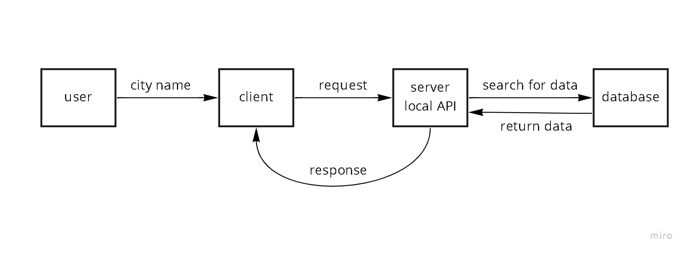

# city-explorer-api
At this repo we will build our API server 

**Author**: Wlla Talafha
**Version**: 1.0.0 

## Overview
This Application has been built to work as a local server using express framework to receive requests and send response with static data stored in .json file.

## Getting Started
<!-- What are the steps that a user must take in order to build this app on their own machine and get it running? -->

## Architecture
- express framework.
- Node js.
- Error handling.

## Change Log

05-08-2022 4:00pm - Application now has a fully-functional express server, with a GET route for the location resource.

## Credit and Collaborations

[Fahad Zidan](https://github.com/fha96?tab=repositories)

I would like to thank him for all collaborations during the lab.

Name of feature: lab 07

Estimate of time needed to complete: 3

Start time: 12 pm

Finish time: 3 pm

Actual time needed to complete: 1:30 hour
